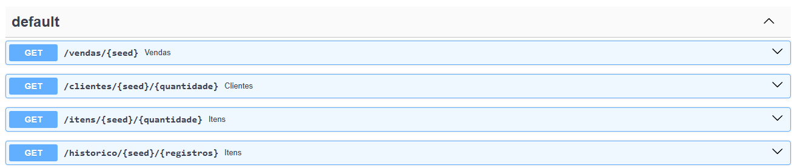
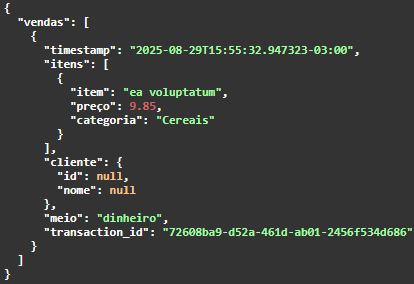

<!---->

<h4>*Este é um repost do mesmo projeto postado em meu Linkedin.</h4>

---

Quem nunca buscou uma base de dados e depois viu que já foi usada dezenas (centenas?) de vezes em portfolios pela internet? Uma opção bem conhecida é usar a biblioteca faker para criar dados fictícios que, apesar de úteis, não trazem um contexto de negócio por si mesmos. Esse ponto é frequentemente ressaltado como uma lacuna dos profissionais de dados: qual o cenário e problema a ser resolvido?

Pensando nisso me propus a criar uma API de dados fictícios (*https://geradordevendas.fly.dev/*) que representasse, na medida do possível, um negócio real. No caso, um pequeno mercado - aquele simpático "mercadinho de bairro". Utilizei a biblioteca faker tentando parametrizar o gerador de forma a emular o business:

- Número de vendas a cada 5 minutos: 1-5
- Número de itens em cada cesta de compras: 1-8
- Valor máximo da cesta: R$200
- Preço de cada item: R$0,99-R$150
- Clientes registrados: 200
- Compras de clientes registrados: 40%
- Ítens registrados: 1200
- Categorias : Açougue, Frios e laticínios, Adega e bebidas, Higiene e limpeza, Hortifruti e mercearia, Padaria, Enlatados, Cereais

A seed fixa a base de clientes, itens e preços; a cesta é gerada de forma aleatória.

Os endpoints */clientes* e */itens* geram uma base aleatória de clientes + id e itens + preço + categoria + estoque. O endpoint */historico* gera um número de registros escolhido pelo usuário. A saída é no formato **json**. A API foi desenvolvida em *FastAPI* e colocada em produção por um arquivo *Docker*. As rotas podem ser diretamente testadas em *https://geradordevendas.fly.dev/docs*:

Veja um exemplo de saída da rota */vendas*:

Usos possíveis dessa API são: elaboração de *dashboards*, transformações ETL/ELT, construção de *datalake*, treinar *storytelling*, modelos *mock*, entre outros. Eu mesmo elaborei um dashboard para testar diferentes formas de visualização de dados. Construir a API e coloca-la em produção, no entanto, foi
o maior aprendizado desse projeto. &#127775;

