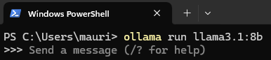
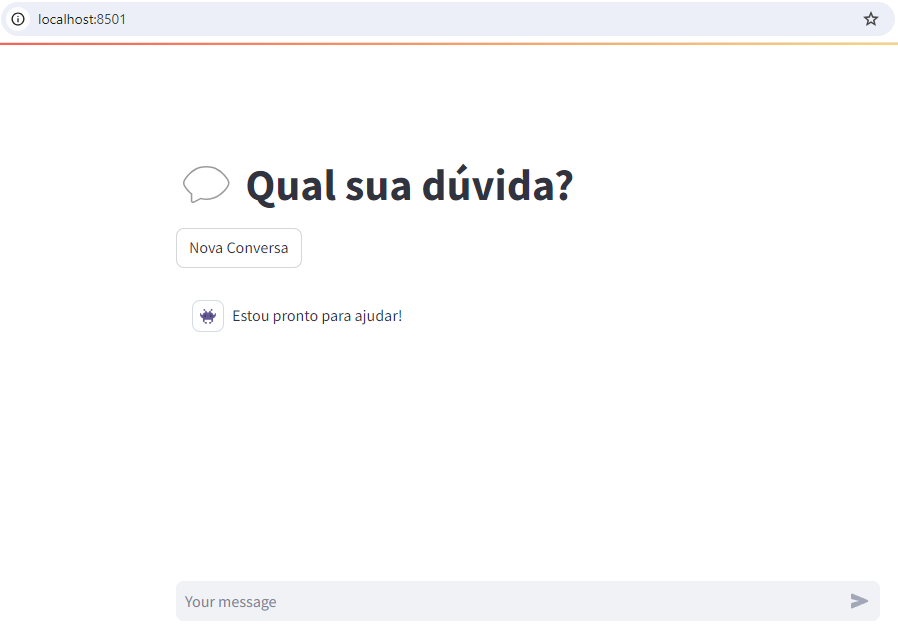
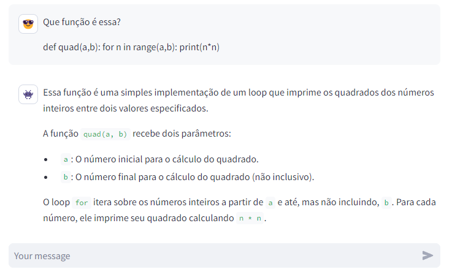

<style>body {text-align: justify}</style>

<!---->

<!---->

## Large Language Models (LLM) já se popularizaram a ponto de ser possível ter um em casa.

---

Apesar do ChatGPT ser ainda o mais popular e talvez o mais poderoso LLM disponível de forma gratuita, nos últimos meses vimos a explosão de modelos LLM open source e/ou customizados para serem usados de forma doméstica. A biblioteca https://huggingface.co/ possui incríveis 825407 modelos LLM disponíveis. Ainda assim, utilizar os modelos requer um conhecimento python mais específico e muitas vezes uma placa gráfica dedicada com muita memória RAM, o que dificulta o uso doméstica.

No entanto, a ferramenta Ollama (https://ollama.com/) permite rodar os modelos sem escrever uma linha de código nem ter um PC de alto padrão (memória RAM ainda é importante mas sem a necessicade de uma placa gráfica dedicada).

Esse projeto é um guia rápido para ter um modelo LLM rodando a partir da solução Ollama em conjunto com um frontend pelo Streamlit, de forma a emular um ChatGPT muito próximo do original[^1].

## 1 Instalar Ollama

O primeiro passo é fazer o download e instalar o Ollama (https://ollama.com/download). Siga as instruções conforme seu sistema operacional.

## 2 Rodar o Ollama

Após instalar, abra o terminal e digite `ollama run llama3.1:8b`. O programa fará *pull* do modelo Meta Llama 3.1 de 4.7GB e irá iniciá-lo.

<span style="display:block;text-align:center"></span>


Você pode interagir com o agente diretamente no terminal, mas veja que assim não é uma forma amigável. Vamos usar o Streamlit para criar um front-end mais parecido com o ChatGPT.


## 3 Criar o front-end

No VSCode, ou outro editor de preferência, faça um arquivo *app.py* com o código a seguir:

```python
import ollama
import streamlit as st


# App IA
class AI():
	def respond(self, lst_messages, model="llama3.1:8b"):
		res_ai = ollama.chat(model=model, 
							 messages=lst_messages,
                  			 stream=True)
		for res in res_ai:
			chunk = res["message"]["content"]
			app["full_response"] += chunk
			yield chunk

ai = AI()

# Frontend
import streamlit as st

st.title('💬 Qual sua dúvida?')
app = st.session_state

if "messages" not in app:
    app["messages"] = [{"role":"assistant", "content":"Estou pronto para ajudar!"}]

if 'full_response' not in app:
    app['full_response'] = '' 

# Botão para limpar conversa
if st.button("Nova Conversa"):
    app["messages"] = [{"role":"assistant", "content":"Estou pronto para ajudar!"}]
    app['full_response'] = ''

# Manter as respostas
for msg in app["messages"]:
    if msg["role"] == "user":
        st.chat_message(msg["role"], avatar="😎").write(msg["content"])
    elif msg["role"] == "assistant":
        st.chat_message(msg["role"], avatar="👾").write(msg["content"])

# Chat
if txt := st.chat_input():
    app["messages"].append({"role":"user", "content":txt})
    st.chat_message("user", avatar="😎").write(txt)

    app["full_response"] = ""
    st.chat_message("assistant", avatar="👾").write_stream(ai.respond(app["messages"]))
    app["messages"].append({"role":"assistant", "content":app["full_response"]})
```

Rode o app com o comando `streamlit run app.py` e abra o seu navegador no endereço http://localhost:8501/.

<span style="display:block;text-align:center"></span>


Vamos testar a resposta do modelo perguntado quem ele é:

<span style="display:block;text-align:center"></span>

O modelo está funcionando. Com essa interface é possível, por exemplo, copiar e colar códigos para o agente avaliar, tal como no ChatGPT.

<span style="display:block;text-align:center"></span>


É importante escolher um dos modelos Ollama que seu PC suporte, pois ele ocupa memória RAM e usa o processador da própria máquina. Como os modelos tem tamanhos diferentes, vá testando aquele que melhor desempenha tendo em vista o seu setup.

[^1]: Não vou cobrir aqui a instalação das bibliotecas e ativação do ambiente virtual, são tópicos encontrados nas documentções amplamente disponíveis.


<!--This theme has a **form-to-email** feature built in, thanks to the simple Formspree integration. All you need to activate the form is a valid recipient email address saved in the front matter of the form
(`/content/forms/contact.md`). Of course, the example shown below (`your@email.here`) must not be used. Please use your actual email address.

```toml
# please replace with a valid Formspree form id or email address
formspree_form_id: your@email.here
```

Update that file and you're ready to begin receiving submissions. Just submit
the active form for the first time, and complete the email address verification
step with Formspree, and your contact form is live. The next time someone
fills it out, the submission will land in your inbox.

### Multiple Layouts

The files included with the theme have a contact page ready for copy/paste, or
you can type `hugo new forms/contact.md` and you're off to the races. There are two
layouts for `forms` – `split-right`, and `split-left` – you guessed it, one puts
the form on the right and the other on the left. You just fill out the front
matter, and the rest is automatic.

```toml
# layout options: split-right or split-left
layout: split-right
```


Both layouts display the page title and description opposite the form, and you
can also choose to show your social icon links if you have those configured in
the `config.toml` file.-->


