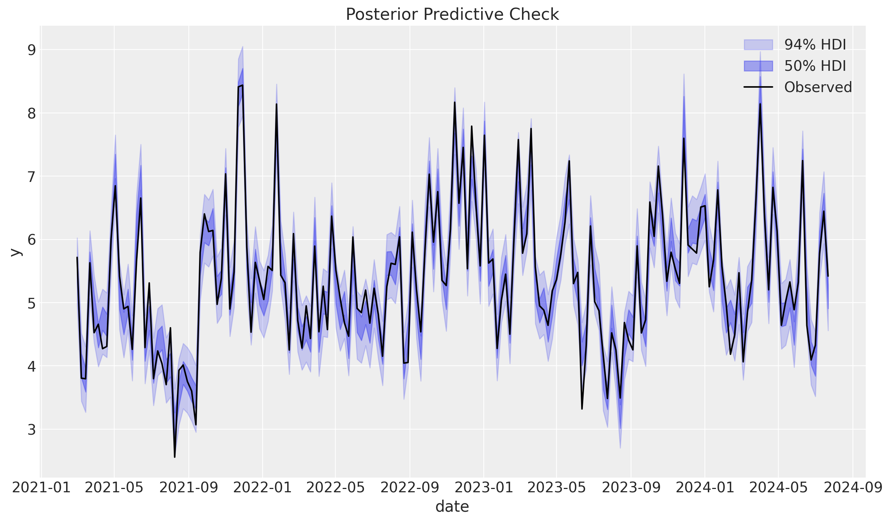
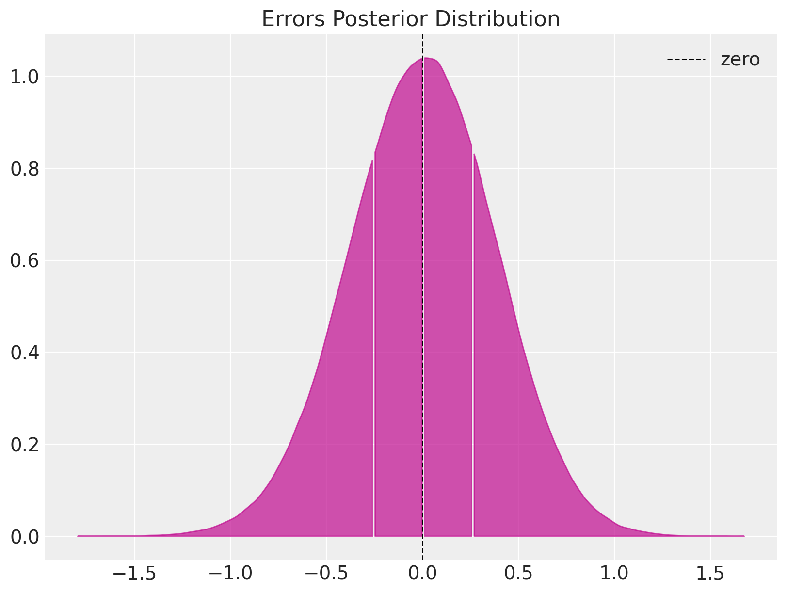
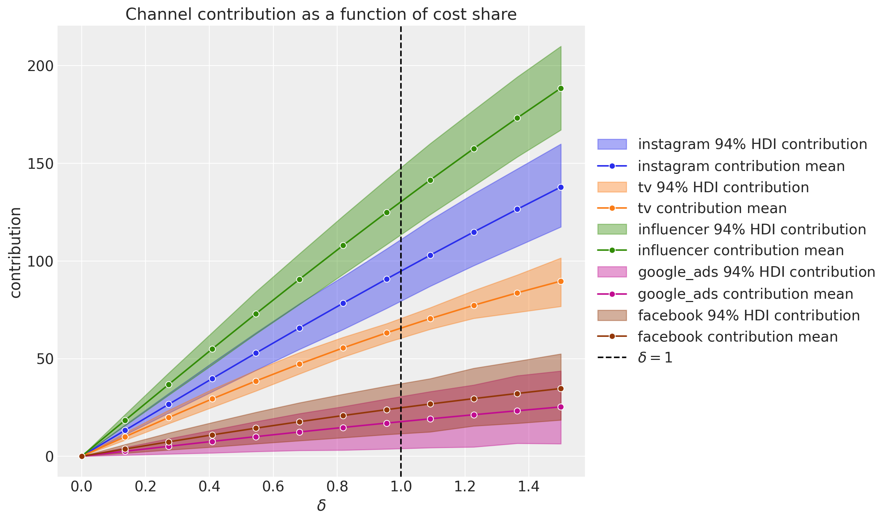
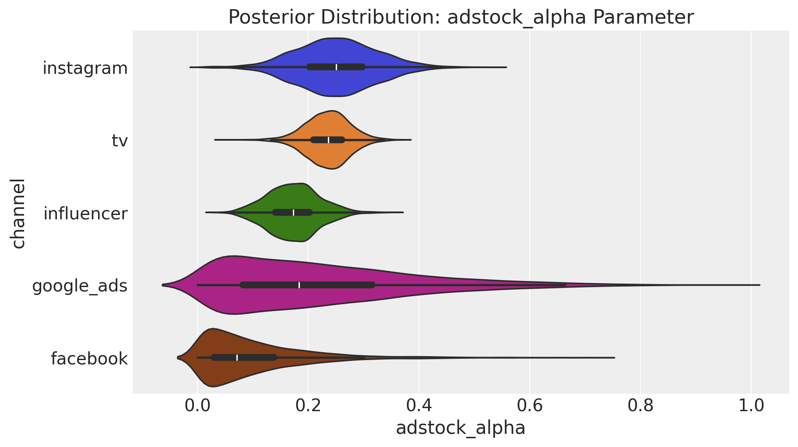
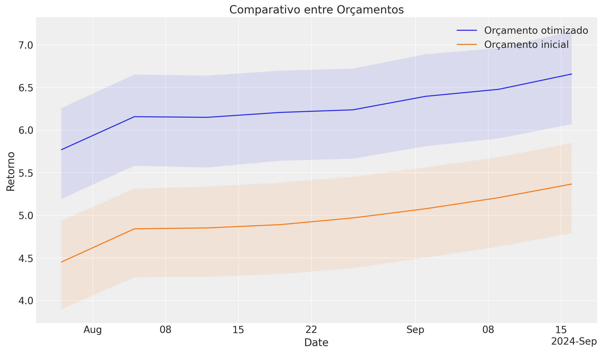
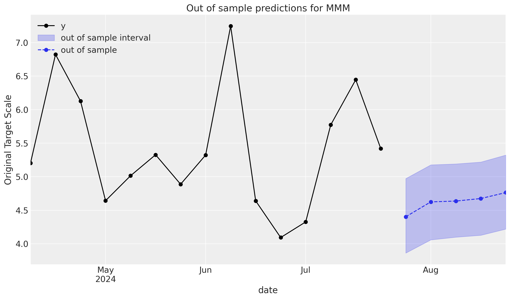

<!---->

---
À medida que o varejo se torna omnichannel, é fundamental avaliar a contribuição não linear das comunicações de marketing entre seus diversos canais - online e offline - para assim maximizar o retorno sobre o investimento (ROAS[^1]).
 
Nesse contexto estimação bayesiana oferece vantagens significativas em relação a regressão tradicional com transformação logística comum em modelos de marketing. Ela permite identificar os efeitos cumulativos de marketing (adstock) e saturação de investimento (até que ponto continuar investindo gera retorno) conjutamente, além de estimar o orçamento ótimo.

O pacote PyMC (https://www.pymc.io/) facilita esse tipo de modelagem que de outra forma necessitaria de muito poder computacional e algoritmos complexos.Também nos fornece uma série de análises e gráficos explicativos, o que, para gestores de canal, oferece ferramentas robustas para tomada de decisão.

Como exemplo, analisando este dataset sintético identificamos que:

#### 1) O fit do modelo é bom
Percebemos que a estimativa está sempre contendo os reais valores da variável vendas.

Os erros de estimativa estão centrados em zero com uma distribuição normal.

#### 2) Os melhores canais são de influencer e instagram, facebook e google_ads desempenham por último
Canais com melhores desempenhos são facilmente reconhecidos.

#### 3) Instagram e tv tem o maior adstock; Facebook o menor
O efeito cumulativo também pode ser visualizado.

#### 4) Facebook e Google Ads saturam mais rápido, Instagram menos
A saturação, ou seja, quando que o canal começa a não responder mais pode ser visualizado nesse gráfico.

E o mais impactante, com um orçamento otimizado é possível incrementar o ROAS em ~30%.

Por fim, é possível prever o retorno sobre vendas. O gráfico abaixo mostra as vendas provenientes apenas dos efeitos cumulativos e de saturação, sem nenhum investimento alocado.

Essa foi apenas uma rápida demonstração do poder preditivo e explicativo desse pacote para modelar e predizer os efeitos das ações de marketing que, no contexto atual de varejo, pode significar milhões a mais ou a menos de faturamento do negócio.

[^1]: Return on Ad Spending.
