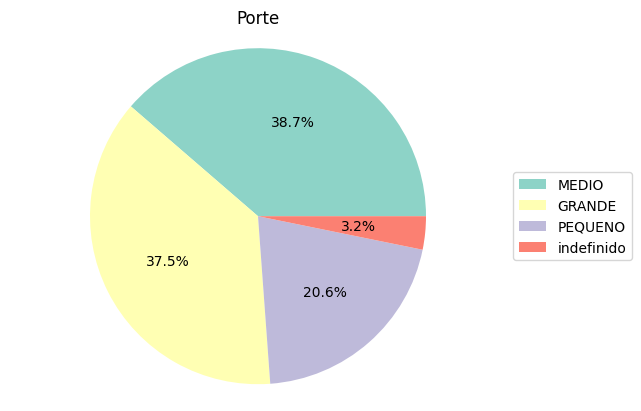

<style>body {text-align: justify}</style>

<!---->

### Tão importante quanto a disponibilidade de crédito é a capacidade de prever um possível *default* e assim ter as provisões necessárias para tal.

---

### Quais as pistas da inadimplência?


Prever **inadimplência** é um problema clássico nas instituições de crédito, ainda mais quando não se tem informações históricas a respeito do cliente. Como saber se um cliente novo não dará "calote"?   

Este projeto desenvolve um modelo de previsão de inadimplência a partir da exploração e engenharia de variáveis de duas *databases* de empréstimos anonimizados. O modelo então é utilizado para prever o *default* em uma lista de clientes **futuros**.

Meu *machine learning pipeline*: importar datasets &#x2192; inspeção &#x2192; preprocessamento &#x2192; análise exploratória &#x2192; modelagem &#x2192; avaliação &#x2192; previsão.

<!---->

---

### Código

Primeiramente vamos **importar** os módulos já sabendo que se trata de um problema de classificação:

```python
import numpy as np
import pandas as pd
```

Vamos trabalhar em dois *datasets*, um com informações de cadastro (`base cadastral`) e outro (`base_pagamentos_desenvolvimento`) que utilizaremos para treinar o modelo:

```python
base_cadastral = pd.read_csv("base_cadastral.csv")
base_pagamentos_desenvolvimento = pd.read_csv("base_pagamentos_desenvolvimento.csv")
```
Iniciando a inspeção:

```python
print(base_cadastral)
print(base_pagamentos_desenvolvimento)
```
Uma rápida olhada em valores nulos para termos ideia do quê trabalhar na base:

```python
print(base_pagamentos_desenvolvimento.isna().sum())
print(base_cadastral.isna().sum())
```

Conclusão, todos os valores nulos pertencem à base cadastral.

A documentação da base indica que `FLAG_PF = X` se pesoa física e `FLAG_PF = NaN` se pessoa jurídica. Portanto:

```python
def flag(x):
    if x == 'X':
        return 'PF'
    else:
        return 'PJ'

base_cadastral['FLAG'] = base_cadastral['FLAG_PF'].apply(lambda x: flag(x))
base_cadastral.drop(columns='FLAG_PF', inplace = True)
```
Agora é necessário tratar `DDD`,`SEGMENTO_INDUSTRIAL`, `PORTE` e `CEP_2_DIG`.

Começando pelo `PORTE`, as categorias são vistas em:

```python
base_cadastral['PORTE'].value_counts()
```
Vamos criar uma nova categoria `indefinido`:

```python
def substituir_nulos(df):
    base_cadastral['PORTE'].fillna('indefinido', inplace=True)
    return base_cadastral

base_cadastral = substituir_nulos(base_cadastral)
```
Apliquei a mesma lógica para `SEGMENTO_INDUSTRIAL`:

```python
def substituir_nulos(df):
    base_cadastral['SEGMENTO_INDUSTRIAL'].fillna('seg_indefinido', inplace=True)
    return base_cadastral

base_cadastral = substituir_nulos(base_cadastral)
```
Da mesma forma, tratamos a coluna `DDD`:

```python
def substituir_nulos(df):
    base_cadastral['DDD'].fillna('ddd_indefinido', inplace=True)
    return base_cadastral

base_cadastral = substituir_nulos(base_cadastral)
```

Por fim, a coluna `CEP_2_DIG`:

```python
def substituir_nulos(df):
    base_cadastral['CEP_2_DIG'].fillna('cep_indefinido', inplace=True)
    return base_cadastral

base_cadastral = substituir_nulos(base_cadastral)
```

### Engenharia de variáveis

Vamos transformaros valores de `DDD` e `CEP_2_DIG` em categorias (regiões e Estado respectivamente) para que assim possam ser utilizadas como variáveis pelo modelo:

```python
def regiao(ddd):
    if ddd in ['61']:
        return 'Centro-Oeste'
    elif ddd in ['62', '64', '65', '66', '67']:
        return 'Centro-Oeste'
    elif ddd in ['82']:
        return 'Nordeste'
    elif ddd in ['71', '73', '74', '75', '77', '85', '88', '98', '99', '83', '81', '87', '86', '89', '84', '79']:
        return 'Nordeste'
    elif ddd in ['68', '96', '92', '97', '91', '93', '94', '69', '95', '63']:
        return 'Norte'
    elif ddd in ['27', '28', '31', '32', '33', '34', '35', '37', '38', '21', '22', '24', '11', '12', '13', '14', '15', '16', '17', '18', '19']:
        return 'Sudeste'
    elif ddd in ['41', '42', '43', '44', '45', '46', '51', '53', '54', '55', '47', '48', '49']:
        return 'Sul'
    else:
        return 'DDD inválido'

base_cadastral['REGIAO'] = base_cadastral['DDD'].apply(regiao)
```
```python
def cep(x):
    if x.startswith('0'):
        return 'São Paulo'
    elif x.startswith('1'):
        return 'Interior de São Paulo'
    elif x.startswith('2'):
        return 'Rio de Janeiro ou Espírito Santo'
    elif x.startswith('3'):
        return 'Minas Gerais'
    elif x.startswith('4'):
        return 'Bahia ou Sergipe'
    elif x.startswith('5'):
        return 'Pernambuco, Alagoas, Rio Grande do Norte ou Paraíba'
    elif x.startswith('6'):
        return 'Maranhão, Acre, Pará, Amapá, Roraima, Ceará ou Amazonas'
    elif x.startswith('7'):
        return 'Mato Grosso do Sul, Tocantins, Mato Grosso, Goiás, Rondônia ou Distrito Federal'
    elif x.startswith('8'):
        return 'Paraná ou Santa Catarina'
    elif x.startswith('9'):
        return 'Rio Grande do Sul'
    else:
        return 'Região não identificada'

base_cadastral['CEP'] = base_cadastral['CEP_2_DIG'].apply(cep)
```

Vimos que a base de treino é pobre em termos de informações individuais. Sendo assim, vamos fundi-la com as informações cadastrais e "enriquecer" o *dataset* de treino para cada cliente (`ID_CLIENTE`). Em seguida, excluir os dados de cadastro sem correspondência:

```python
base_treino = pd.merge(base_pagamentos_desenvolvimento,base_cadastral,on=['ID_CLIENTE'], how='outer')
base_treino.drop(base_treino.index[77414:], inplace=True)
```

Uma olhada nos dados faltantes agora na base de treino completa:

```python
print(base_treino.isna().sum())
```
Temos nulos apenas no domínio de e-mail (`DOMINIO_EMAIL`), uma informação irrelevante para o problema. Agora Podemos excluí-la.

```python
base_treino.drop(columns=['DOMINIO_EMAIL'], inplace = True)
```

Identificamos os inadimplentes a partir do critério dado na documentação (pagamento atrasado em mais de 5 dias), atribuindo o valor 1 ou 0:

```python
base_treino['DATA_PAGAMENTO'] = pd.to_datetime(base_treino['DATA_PAGAMENTO'])
base_treino['DATA_VENCIMENTO'] = pd.to_datetime(base_treino['DATA_VENCIMENTO'])

base_treino['INADIMPLENTE'] = np.where((base_treino['DATA_PAGAMENTO'] - base_treino['DATA_VENCIMENTO']).dt.days >= 5, 1, 0)
```

Agora podemos partir para a **análise exploratória**.

### Análise Exploratória (EDA)

A proporção de empréstimos por mês pode indicar alguma sazonalidade:

```python
import calendar
import matplotlib.pyplot as plt

contagem_mes = base_treino['MES'].value_counts()

nomes_meses = [calendar.month_name[mes] for mes in contagem_mes.index]

fig, ax = plt.subplots()
contagem_mes.plot.pie(labels=nomes_meses, autopct='%1.1f%%', ax=ax)
plt.axis('equal') 

plt.title('Número de operações por mês', pad=20)
ax.set_ylabel(None)
plt.show()
```


O número de operações está bem distribuida durante os anos. Em relação às taxas aplicadas, a maioria foi de 5,99 e 6,99%:

```python
contagem_taxa = base_treino['TAXA'].value_counts()

plt.pie(contagem_taxa, labels=None, autopct='%1.1f%%')

plt.axis('equal')

plt.title('Taxas de Empréstimo')

plt.legend(contagem_taxa.index, loc='center left', bbox_to_anchor=(1, 0.5))

plt.show()
```


Em relação ao valor do empréstimos, o box-plot de `VALOR_A_PAGAR` está muito achatado, indicando que existem valores discrepantes:

```python
media = np.mean(base_treino['VALOR_A_PAGAR'])

plt.boxplot(base_treino['VALOR_A_PAGAR'])

plt.text(1.1, media, f'Média = {media:.2f}', color='b')

plt.ylabel('Valor a Pagar')

plt.title('Boxplot - Valor a Pagar')

plt.legend()
plt.show()
```


Será necessário tratar os *outliers* posteriormente. Em relação aos segmentos, a maioria está no setor de serviços:

```python
contagem_segmento = base_treino['SEGMENTO_INDUSTRIAL'].value_counts()

plt.pie(contagem_segmento, labels=None, autopct='%1.1f%%', colors=plt.cm.Set3.colors)

plt.axis('equal')

plt.title('Segmento Industrial')

plt.legend(contagem_segmento.index, loc='center left', bbox_to_anchor=(1, 0.5))

plt.show()
```


O número de operações efetuadas por em segmentos indefinidos representa apenas 1,8% de tal forma que podemos pensar em eliminá-las da base.Em relação ao porte, temos número similar de empresas de grande e médio porte, e menos pequenas empresas:

```python
contagem_porte = base_treino['PORTE'].value_counts()

plt.pie(contagem_porte, labels=None, autopct='%1.1f%%', colors=plt.cm.Set3.colors)

plt.axis('equal')
plt.title('Porte')

plt.legend(contagem_porte.index, loc='center left', bbox_to_anchor=(1, 0.5))
plt.show()
```



As operações relacionadas com porte indefinido representam apenas 3,2% mas ainda assim podem tender para algum lado (por exemplo, falhas sistemáticas no cadastro). Deve-se avaliar melhor o caso de eliminá-las. Fica claro também que a esmagadora maioria são operações de pessoas jurídicas:

```python
contagem_flag = base_treino['FLAG'].value_counts()

plt.pie(contagem_flag, labels=None, autopct='%1.1f%%', colors=plt.cm.Set3.colors)

plt.axis('equal')
plt.title('PF e PJ')


plt.legend(contagem_flag.index, loc='center left', bbox_to_anchor=(1, 0.5))
plt.show()
```


Ainda que o número de transações seja irrisório, não se pode excluir uma característica tão relevante no mercado de empréstimos. Existe uma ampla predominância da região sudeste, provavelmente pela alta atividade econômica nessa região:

```python
contagem_regiao = base_treino['REGIAO'].value_counts()

percentual_regiao = contagem_regiao / contagem_regiao.sum() * 100

plt.figure(figsize=(12, 3))

plt.barh(contagem_regiao.index, percentual_regiao.values, color=plt.cm.Set2.colors)

plt.gca().invert_yaxis()

for i, v in enumerate(percentual_regiao.values):
    plt.text(v, i, f'{v:.1f}%', color='black', va='center')

plt.title('Distribuição por Região')
plt.xlabel('Percentual')
plt.show()
```


O `CEP` também pode nos dar noção dos estados com maior número de operações:

```python
contagem_cep = base_treino['CEP'].value_counts()

plt.figure(figsize=(12, 10))

plt.barh(contagem_cep.index, contagem_cep.values, color=plt.cm.Set2.colors)

plt.gca().invert_yaxis()

plt.title('Operações por Estado')

plt.xlabel('Contagem')

for i, v in enumerate(contagem_cep.values):
    percentual = v / contagem_cep.sum() * 100
    plt.text(v + 3, i, f'{percentual:.1f}%', color='black', va='center')

plt.show()
```


Paraná, Santa Catarina, São Paulo e interior concentrar a maior parte das operações (corroborando com as regiões). O `CEP` não identificado é irrisório, por isso podemos eliminá-lo mais a frente. Finalmente, o percentual de operaçoes em *default*:

```python
contagem_inadimplentes = base_treino['INADIMPLENTE'].value_counts()

plt.figure(figsize=(6, 2))

plt.barh(contagem_inadimplentes.index[::-1], contagem_inadimplentes.values[::-1], color='gray', height=0.3)
plt.title('Número de Operações')

plt.yticks([0, 1], ['Adimplentes (93%)', 'Inadimplentes (7%)'])

plt.gca().invert_yaxis()

plt.show()
```


O número de inadimplentes mostra uma característica clássica desse tipo de problema: a categoria alvo é minora, ou seja, os dados são desbalanceados (muito desproporcionais). É necessário pensar como tratá-los antes de treinar o modelo.

### Pré processamento

Optei por elimiar as observações (linhas) com `CEP` não identificado:

```python
base_treino = base_treino.drop(base_treino[base_treino['CEP'] == 'Região não identificada'].index)
```

Excluí os *outliers* pelo critério padrão de *box-plot*:

```python
Q1 = np.percentile(base_treino['VALOR_A_PAGAR'], 25)
Q3 = np.percentile(base_treino['VALOR_A_PAGAR'], 75)
IQR = Q3 - Q1
limite_inferior = Q1 - 1.5 * IQR
limite_superior = Q3 + 1.5 * IQR

outliers = base_treino[(base_treino['VALOR_A_PAGAR'] < limite_inferior) | (base_treino['VALOR_A_PAGAR'] > limite_superior)]

base_treino_sem_outliers = base_treino.drop(outliers.index)

numero_outliers = len(outliers)
print(f"Número de outliers removidos: {numero_outliers}")
```
No caso foram removidos 4264 linhas. Uma rápida olhada no *box-plot* atualizado:


Podemos ver que está mais equilibrado. É necessário criar *dummies* para as categorias que foram criadas anteriormente para cada variável e excluir as colunas tratadas:

```python
colunas_dummy = ['SEGMENTO_INDUSTRIAL', 'PORTE', 'FLAG', 'REGIAO', 'CEP']

dummy_variables = pd.get_dummies(base_treino_sem_outliers[colunas_dummy])

base_treino_sem_outliers = pd.concat([base_treino_sem_outliers, dummy_variables], axis=1)

base_treino_sem_outliers.drop(columns=colunas_dummy, inplace=True)
```

### Seleção de variáveis

Antes de escolher quais variáveis vamos incluir, podemos olhar a correlação para ter uma ideia do que está mais relacionado com a variável alvo (inadimplência):

```python
colunas_selecionadas = ['TAXA',
                        'VALOR_A_PAGAR',
                        'SEGMENTO_INDUSTRIAL_Comércio',
                        'SEGMENTO_INDUSTRIAL_Indústria',
                        'SEGMENTO_INDUSTRIAL_Serviços',
                        'SEGMENTO_INDUSTRIAL_seg_indefinido',
                        'PORTE_GRANDE',
                        'PORTE_MEDIO',
                        'PORTE_PEQUENO',
                        'PORTE_indefinido',
                        'FLAG_PF',
                        'FLAG_PJ',
                        'REGIAO_Centro-Oeste',
                        'REGIAO_DDD inválido',
                        'REGIAO_Nordeste',
                        'REGIAO_Norte',
                        'REGIAO_Sudeste',
                        'REGIAO_Sul',
                        'CEP_Bahia ou Sergipe',
                        'CEP_Interior de São Paulo',
                        'CEP_Maranhão, Acre, Pará, Amapá, Roraima, Ceará ou Amazonas',
                        'CEP_Mato Grosso do Sul, Tocantins, Mato Grosso, Goiás, Rondônia ou Distrito Federal',
                        'CEP_Minas Gerais', 'CEP_Paraná ou Santa Catarina',
                        'CEP_Pernambuco, Alagoas, Rio Grande do Norte ou Paraíba',
                        'CEP_Rio Grande do Sul',
                        'CEP_Rio de Janeiro ou Espírito Santo',
                        'INADIMPLENTE']


df_selecionado = base_treino_sem_outliers[colunas_selecionadas]

matriz_correlacao = df_selecionado.corr()

correlacao_inadimplente = matriz_correlacao['INADIMPLENTE']

print(correlacao_inadimplente.sort_values(ascending=False))
```
Infelizmente `PORTE_indefinido` é uma característica com quase 8% de correlação. Analizando essa categoria vemos que ela não possui um padrão, está mais relacionada com duas datas específicas (15/08/2000 e 29/12/2015), ou seja, erros de cadastro[^1]. Assim sendo, escolhi deixar de fora do modelo.

Optei por eliminar variáveis com correlação menor que 0,00%. A lista final de variáveis ficou:

```python
colunas_selecionadas = ['VALOR_A_PAGAR',
                        'SEGMENTO_INDUSTRIAL_Comércio',
                        'SEGMENTO_INDUSTRIAL_Indústria',
                        'SEGMENTO_INDUSTRIAL_Serviços',
                        'PORTE_GRANDE',
                        'PORTE_MEDIO',
                        'PORTE_PEQUENO',
                        'REGIAO_Norte',
                        'REGIAO_Sudeste',
                        'REGIAO_Sul',
                        'CEP_Maranhão, Acre, Pará, Amapá, Roraima, Ceará ou Amazonas',
                        'CEP_Mato Grosso do Sul, Tocantins, Mato Grosso, Goiás, Rondônia ou Distrito Federal',
                        'CEP_Minas Gerais',
                        'CEP_Paraná ou Santa Catarina',
                        'CEP_Pernambuco, Alagoas, Rio Grande do Norte ou Paraíba',
                        'CEP_Rio Grande do Sul']
                        
```

### Treinar o Modelo

Escolhi o modelo `XGBClassifier` para treinar o algoritmo de classificação e posteriormente utilizá-lo na previsão de inadimplência em operações ainda não vistas:

```python
import xgboost as xgb
from sklearn.model_selection import train_test_split

X = base_treino_sem_outliers[colunas_selecionadas]
y = base_treino_sem_outliers['INADIMPLENTE']

X_train, X_test, y_train, y_test = train_test_split(X, y, test_size=0.2, random_state=42)

model = xgb.XGBClassifier()
model.fit(X_train, y_train)
```
O desempenho do modelo pode ser aferido pelo *report*:

```python
from sklearn.metrics import classification_report

report = classification_report(y_test, y_pred)
print(report)
```

Em problemas desse tipo é crucial que a classificação da categoria minoritária seja a maior possível, portanto a taxa de acerto global é menos importante. Nesse caso, o modelo acertou 70% dos casos de inadimplência. Esse será o *benchmark* antes de otimizar o modelo.

Também é interessante saber quais as características mais importantes na previsão:

```python
fi = pd.DataFrame (data = model.feature_importances_,
                   index=colunas_selecionadas,
                   columns = ['Importância'])
fi.sort_values('Importância').plot(kind='barh', title='Importância')
plt.show()
```


### Otimização

Iniciei a otimização do modelo com alterações mais simples, para então depois entrar nos detalhes de estimação (parâmetros). Primeiro, transformei a variável `VALOR_A_PAGAR` aplicando `log`, pois assim a grandeza fica mais próxima dos valores *dummy* de 0 ou 1:

```python
base_treino_sem_outliers['LOG_PAGAR'] = np.log(base_treino_sem_outliers['VALOR_A_PAGAR'])
```
Rodando novamente o modelo a precisão da variável alvo aumentou para **72%**, acima do *benchmark*.
Tendo em vista que as categorias ainda estão desbalanceadas, testei uma proporção 80/20 para a categoria alvo:

```python
from imblearn.under_sampling import RandomUnderSampler

# Separar as features (X) e o target (y)
X = base_treino_sem_outliers.drop('INADIMPLENTE', axis=1)
y = base_treino_sem_outliers['INADIMPLENTE']

# Criar uma instância do RandomUnderSampler
rus = RandomUnderSampler(sampling_strategy=0.2)

# Aplicar o undersampling para obter uma proporção de 20% da classe minoritária
X_resampled, y_resampled = rus.fit_resample(X, y)

# Criar a nova base de dados rebalanceada
base_rebalanceada = X_resampled.copy()
base_rebalanceada['INADIMPLENTE'] = y_resampled
```
O *report* agora indica uma precisão de **74,3%** para a categoria alvo, apesar de uma diminuição geral da precisão para **90,5%**. Resta testar hiparâmetro diversos para ver se é possível uma aconseguir uma precisão ainda maior que o modelo base.

Teoricamente, as combinações de hiperparâmetros são infinitas, por isso determinei alguns para testar.


<!--
> ##### CSS Grid Layout Module
>
> This CSS module defines a two-dimensional grid-based layout system, optimized for user interface design. In the grid layout model, the children of a grid container can be positioned into arbitrary slots in a predefined flexible or fixed-size layout grid.
>
> — _W3C_

CSS Grid is a total game changer, IMHO. Compared to the bottomless pit of despair that is the old way, the new way of building a site structure can be done in as little as 5 lines of CSS. Of course, it always takes more than that, but not much. I mean this is really the meat of the deal:

```css
.grid-container {
  display: grid;
  grid-template-columns: repeat(6, 1fr);
  grid-template-rows: repeat(3, auto);
}
```

#### What an amazing time to be a web developer. Anyway, I hope you enjoy this "feature" that you'll probably never notice or even see. Maybe that's the best part of a good user interface – the hidden stuff that just works.-->

[^1]: Filtrando a `base_treino` em que `base_treino['REGIAO'] == 'DDD inválido'` e aplicando `value_counts()`.

